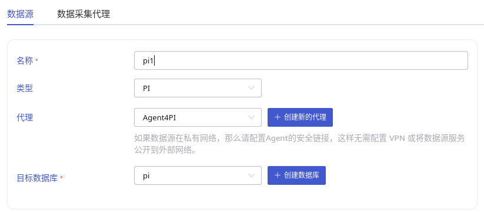
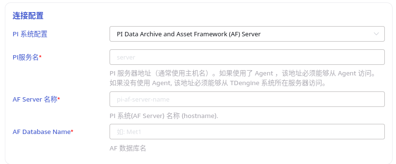

本节讲述如何通过 Explorer 界面创建数据迁移任务, 从 PI 系统迁移数据到当前 TDengine 集群。

## 功能概述

PI 系统是一套用于数据收集、查找、分析、传递和可视化的软件产品，可以作为管理实时数据和事件的企业级系统的基础架构。

taosX 可以通过 PI 连接器插件从 PI 系统中提取实时数据。

有两类 PI 任务： 实时同步任务和历史数据迁移任务，在任务下拉列表的名称分别对应 “PI” 和 “PI backfill”。

## 创建任务

### 1. 新增数据源

在数据写入页面中，点击 **+新增数据源** 按钮，进入新增数据源页面。

### 2. 配置基本信息

在 **名称** 中输入任务名称，如：“test”；

在 **类型** 下拉列表中选择 **PI** 或 **PI backfill**。

如果 taosX 服务运行在 PI 系统所在或可直连的服务器上（依赖 PI AF SDK），**代理** 是不必须的，否则，需要配置 **代理** ：在下拉框中选择指定的代理，也可以先点击右侧的 **+创建新的代理** 按钮创建一个新的代理 ，跟随提示进行代理的配置。即：taosX 或其代理需要部署在可直接连接 PI 系统的主机上。

在 **目标数据库** 下拉列表中选择一个目标数据库，也可以先点击右侧的 **+创建数据库** 按钮创建一个新的数据库。

### 3. 配置连接信息

PI 连接器支持两种连接方式：

1. **PI Data Archive Only**: 不使用 AF 模式。此模式下直接填写 **PI 服务名**（服务器地址，通常使用主机名）。

   
2. **PI Data Archive and Asset Framework (AF) Server**: 使用 AF SDK。此模式下除配置服务名外，还需要配置PI 系统(AF Server) 名称 (hostname) 和 AF 数据库名。

   

点击 **连通性检查** 按钮，检查数据源是否可用。

### 4. 配置数据模型

这一部分，我们用一个 csv 文件配置 PI 的数据模型到 TDengine 的数据模型的映射规则。这里所说的映射规则包含 3 方面内容：

1. 定义源数据范围，即哪些点或哪些模板需要同步到 TDengine。
2. 定义过滤规则，即符合什么条件的数据才需要同步到 TDengine。
3. 定义转换规则，即对原始数据做什么样的变换后再写入 TDengine。

如果您不知道具体怎么操作，可以点击“下载默认配置”按钮，下载得到的 csv 文件有详细的使用说明。

### 5. 其他配置

其余的配置，比较重要的是：

1. 对于 PI 任务，配置“重启补偿时间”，如果任务意外中断，重启时配置这个参数非常有用，它会让 taosX 自动 backfill 一段时间的数据。
2. 对于 PI backfill 任务，需要配置 backfill 的开始和结束时间。

高级配置部分可以配置连接器日志的级别、批次大小、和批次延迟。用于 Debug 和 性能优化。