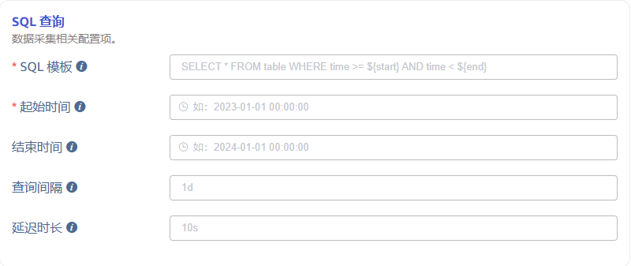
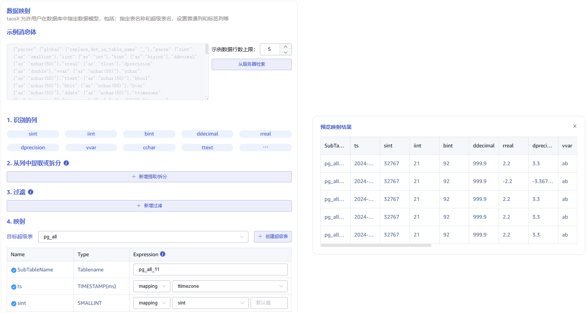

本节讲述如何通过 Explorer 界面创建数据迁移任务，从 PostgreSql 迁移数据到当前 TDengine 集群。

## 功能概述

PostgreSQL 是一个功能非常强大的、源代码开放的客户/服务器关系型数据库管理系统，有很多在大型商业 RDBMS 中所具有的特性，包括事务、子选择、触发器、视图、外键引用完整性和复杂锁定功能。

TDengine 可以高效地从 PostgreSQL 读取数据并将其写入 TDengine，以实现历史数据迁移或实时数据同步。

## 创建任务

### 1. 新增数据源

在数据写入页面中点击左上角的 **+新增数据源** 按钮进入新增数据源页面，如下图所示：

### 2. 配置基本信息

在 **名称** 字段中输入任务名称，例如 *`test_postgres_01`* 。

选择 **类型** 下拉框中的 *`PostgreSQL`* ，如下图所示（选择完成后页面中的字段会发生变化）。

**代理** 是非必填项，如有需要，可以在下拉框中选择指定的代理，也可以先点击右侧的 **+创建新的代理** 按钮创建一个新的代理 。

**目标数据库** 是必填项，可以先点击右侧的 **+创建数据库** 按钮创建一个新的数据库。

### 3. 配置连接信息

在 **连接配置** 区域填写 *`源 PostgreSQL 数据库的连接信息`*，如下图所示：

### 4. 配置认证信息

**用户** 输入源 PostgreSQL 数据库的用户，该用户必须在该组织中拥有读取权限。  

**密码** 输入源 PostgreSQL 数据库中上方用户的登陆密码。 

  

### 5. 配置连接选项

**应用名称** 设置应用程序名称，用于标识连接的应用程序。

**SSL 模式** 设置是否与服务器协商安全 SSL TCP/IP 连接或以何种优先级进行协商。默认值是 PREFER。可选项有 DISABLE、ALLOW、PREFER、REQUIRE。

  

然后点击 **检查连通性** 按钮，用户可以点击此按钮检查上方填写的信息是否可以正常获取源 PostgreSQL 数据库的数据。

### 6. 配置 SQL 查询

**SQL 模板** 用于查询的 SQL 语句模板，SQL 语句中必须包含时间范围条件，且开始时间和结束时间必须成对出现。SQL 语句模板中定义的时间范围由源数据库中的某个代表时间的列和下面定义的占位符组成。
> SQL使用不同的占位符表示不同的时间格式要求，具体有以下占位符格式：
> 1. `${start}`、`${end}`：表示 RFC3339 格式时间戳，如： 2024-03-14T08:00:00+0800
> 2. `${start_no_tz}`、`${end_no_tz}`: 表示不带时区的 RFC3339 字符串：2024-03-14T08:00:00
> 3. `${start_date}`、`${end_date}`：表示仅日期，如：2024-03-14

**起始时间** 迁移数据的起始时间，此项为必填字段。

**结束时间** 迁移数据的结束时间，可留空。如果设置，则迁移任务执行到结束时间后，任务完成自动停止；如果留空，则持续同步实时数据，任务不会自动停止。

**查询间隔** 分段查询数据的时间间隔，默认1天。为了避免查询数据量过大，一次数据同步子任务会使用查询间隔分时间段查询数据。

**延迟时长** 实时同步数据场景中，为了避免延迟写入的数据丢失，每次同步任务会读取延迟时长之前的数据。

 

### 7. 配置数据映射

在 **数据映射** 区域填写数据映射相关的配置参数。

点击 **从服务器检索** 按钮，从 PostgreSQL 服务器获取示例数据。

在 **从列中提取或拆分** 中填写从消息体中提取或拆分的字段，例如：将 vValue 字段拆分成 `vValue_0` 和 `vValue_1` 这 2 个字段，选择 split 提取器，seperator 填写分割符 `,`, number 填写 2。

在 **过滤** 中，填写过滤条件，例如：填写`Value > 0`，则只有 Value 大于 0 的数据才会被写入 TDengine。

在 **映射** 中，选择要映射到 TDengine 的超级表，以及映射到超级表的列。

点击 **预览**，可以查看映射的结果。

### 8. 配置高级选项

**高级选项** 区域是默认折叠的，点击右侧 `>` 可以展开，如下图所示：

**最大读取并发数** 数据源连接数或读取线程数限制，当默认参数不满足需要或需要调整资源使用量时修改此参数。

**批次大小** 单次发送的最大消息数或行数。默认是 10000。

### 9. 创建完成

点击 **提交** 按钮，完成创建 PostgreSQL 到 TDengine 的数据同步任务，回到**数据源列表**页面可查看任务执行情况。
